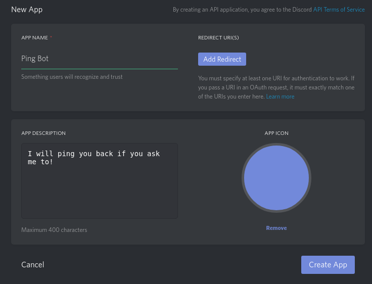
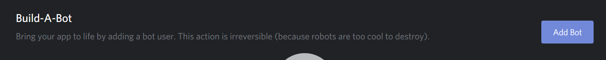
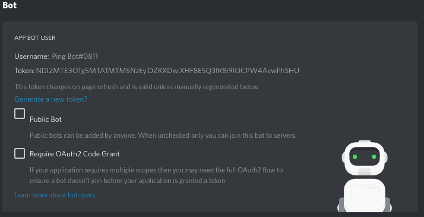
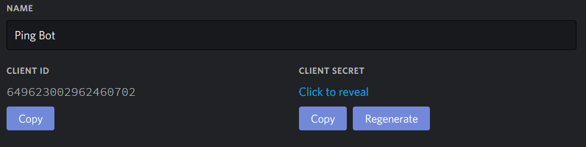

.. _basic_usage:

========================
Basic Usage Instructions
========================

Configuring Enigma
==================

To start using Enigma, we to get some configuration details.
First let's make sure Enigma is installed.

::

    $ enigma -V
    enigma 0.1.0.dev

Looks good! So, we need to head over to the `discord developers portal <https://discordapp.com/developers/applications/me/create>`_ and create our bot user.

Now this is the most important part. We need to create a configuration file which is also valid TOML.

.. code-block:: cfg

    [bot]

    token = ""

    [database]

    host = ""
    port =
    username = ""
    password = ""
    database = ""

    [global]

    prefixes = []
    description = ""

To fill this out we need to know some details about our discord bot user. Simply scrolling down and clicking "Create a Bot User" will do the job.

Next click to reveal the token.

    Make sure to copy this token down!

For now we won't be delving in making our bot public and we'll stick to using our bot privately in a server of our choice.
Save your changes and use this link replacing ``BOT_CLIENT_ID`` with your bot's client ID to invite Enigma to our server,

Invite Link : ``https://discordapp.com/api/oauth2/authorize?client_id=BOT_CLIENT_ID&permissions=8&scope=bot``

You can get the client ID from your bot's app page.

Now that we have all the details, we can start filling in our config file. It should look something like this.
You should also already have your database connection details. If not, read :ref:`configuring_database`.

.. code-block:: cfg

    [bot]

    token = "NDI2MTE3OTg5MTA1MTM5NzEy.DZRbXQ.CYHYtqRXjWYgJO9PqLoIv-HT8SE"

    [database]

    host = "myvps.com" # This can also be an IP address
    port = 5432
    username = "pingbot"
    password = "ilov3bacon"
    database = "pingbot"

    [global]

    prefixes = ["!" , "="]
    description = "I will ping you back. Don't worry!"

Starting Enigma
===============

Now that we have a config file ready. Let's save it is somewhere. By convention, it's named ``app.cfg``.

Now let's tell Enigma to start by passing the path to this file as an argument.

::

    enigma start --config /path/to/app.cfg

.. note::

    You can also place it in the ``enigma/app.cfg`` folder of the repository if you installed from source.
    However, you must make sure to name it ``app.cfg`` in this case or Enigma will throw an error.
